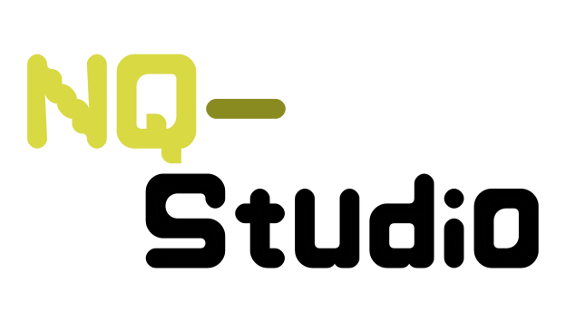

# NQ-Studio Development Branch

    

    
    
    
    

> ⚠️ Crashes and bugs are expected in this branch!

This branch contains features that are currently under development, such as:

* 📄 `Makefile support`
* 🎨 `UI updates`
* 🖼️ `New icons`

### About the PRs

All incoming PRs will get a quick review and will probably go into the `dev` branch first.
